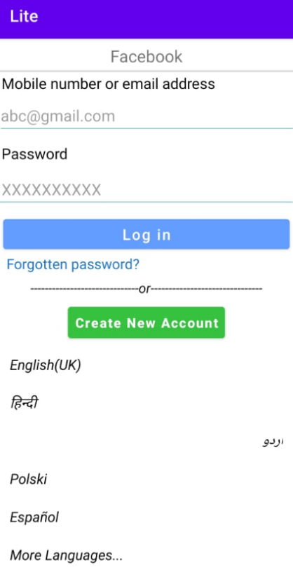
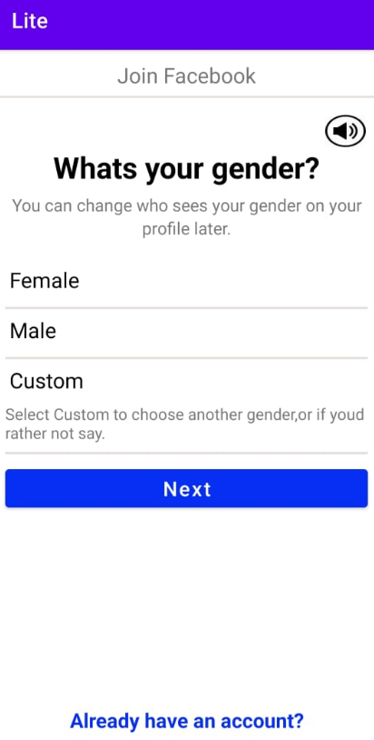

# 📘 Facebook Lite Clone Android App

A lightweight Android social media app inspired by Facebook Lite. This app provides essential Facebook features with a focus on speed, efficiency, and simplicity. Users can sign up, log in, Select Gender all wrapped in a clean Material Design interface.

## 🛠️ Technologies Used

- **Kotlin**  
- **Android SDK**  
- **XML for UI layouts**  
- **Material Design Components**  
- **Git & GitHub for version control**

## ✨ Features

- **User authentication** (Sign up, login, logout)  
- **Smooth, responsive UI** with Material Design  

## 🚀 How to Run
````
1. git clone https://github.com/Jasleen-Kaur-123/FacebookLite-UI-Kotlin
2. Open it in Android Studio  
3. Build and run the app on your device or emulator
````

## 📸 Screenshots

### Facebook Lite Login Page
  

### Facebook Lite Select Gender Page
  

